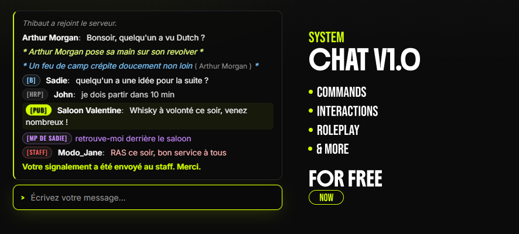

# ks-chat

**CHAT V1.0** — Commands · Interactions · Roleplay · & more, for free, now.

A full, custom RP chat resource for **RedM / VORP**, built by [KEOPS Studios](https://keops-studios.com).

> 🌐 More free & premium RedM scripts: **[keops-studios.com](https://keops-studios.com)**

---

## Features

- Drop-in replacement for the default FiveM/RedM chat (`chat:addMessage`, `chat:addSuggestion`, `chat:addTemplate`, `chat:clear`, `chatMessage` — same event names, so it stays compatible with `vorp_core` and other resources that push messages to the default chat).
- Proximity-based RP channels, calculated **server-side** (no client-reported coordinates).
- Roleplay commands out of the box: `/me`, `/do`, `/ooc`, `/b` (local OOC), `/ad`, `/mp`, `/r`, `/a` (staff), `/report`, `/clearchat`.
- Session/admin interactions: `/disconnect` (retour à l'écran de sélection de personnage) and `/annonce` (bandeau d'annonce admin, staff uniquement).
- Anti-spam cooldown, message length limits, optional link filtering / banned-word filtering.
- Optional Discord webhook relay (OOC, admin chat, reports).
- Clean, auto-hiding UI with sound notification, built with the exact colors, typography and icon set (Phosphor Icons) of [keops-studios.com](https://keops-studios.com).
- Fully configurable through a single `config.lua`.

## Requirements

- [RedM](https://redm.gg/) server (`fx_version 'cerulean'`, `game 'rdr3'`)
- [VORP Core](https://github.com/VORPCORE/vorp-core)

## Installation

1. Download or clone this repository into your `resources/` folder.
2. Disable the stock chat resource in your `server.cfg`:
   ```cfg
   # remove or comment out:
   # ensure chat
   ```
3. Add `ks-chat` to your `server.cfg`, **started before** `vorp_core` and any resource that registers command suggestions:
   ```cfg
   ensure ks-chat
   ensure vorp_core
   ```
4. Edit `config.lua` to taste (chat key, ranges, commands, Discord webhooks, staff groups, word filter...).
5. Restart your server.

## Commands

| Command | Description | Range |
|---|---|---|
| `T` (configurable) | Open the chat input | — |
| *(no slash)* | Talk (roleplay, visible nearby) | 20 m |
| `/me <text>` | Roleplay action, 3rd person | 20 m |
| `/do <text>` | Describe a visible scene/object | 20 m |
| `/ooc <text>` | Out-of-character message | server-wide |
| `/b <text>` | Out-of-character message | local (25 m) |
| `/ad <text>` | Advertisement (configurable cooldown / cost) | server-wide |
| `/mp <id> <text>` | Private message to a player | — |
| `/r <text>` | Reply to the last private message received | — |
| `/a <text>` | Staff-only chat (`Config.StaffGroups`) | online staff |
| `/report <text>` | Report an issue to online staff | online staff |
| `/clearchat` | Clear your own chat window (local only) | — |
| `/disconnect` | Return to the character selection screen without a full reconnect | — |
| `/annonce <text>` | Broadcast an admin announcement banner (`ks-announce`, requires `allow_announce`) | server-wide |

## Configuration

Everything lives in `config.lua`:
- `Config.StaffGroups` — VORP groups allowed to use `/a` and receive `/report`.
- `Config.Discord` — webhooks to log global OOC, staff chat, and reports.
- `Config.Ranges` — RP proximity ranges, in meters.
- `Config.Ad` — advertisement cooldown / cost.
- `Config.Filter` — link blocking and banned-word list.

## Compatibility notes

`ks-chat` re-implements the standard chat event names (`chat:addMessage`, `chat:addSuggestion`, `chat:removeSuggestion`, `chat:addTemplate`, `chat:clear`), so any resource that triggers those events to push a message — `vorp_core` included — keeps working unmodified.

**Exports are resource-scoped**, however: a resource calling `exports.chat:addMessage(...)` (targeting the stock resource literally named `chat`) will **not** reach `ks-chat`. Point it at `exports['ks-chat']:AddMessage(...)` instead.

## License

MIT — see [LICENSE](./LICENSE). Free to use, modify, and redistribute; just keep the copyright notice.

## Credits

Built by **[KEOPS Studios](https://keops-studios.com)** — RedM/VORP scripts and server setups.

- 🌐 Website: [keops-studios.com](https://keops-studios.com)
- 💬 Discord: [discord.gg/y8rJYmby2d](https://discord.gg/y8rJYmby2d)
- 🐙 GitHub: [github.com/ks-lumi](https://github.com/ks-lumi)
